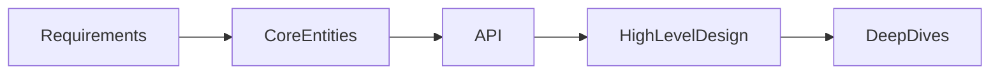

# DropBox 

## FunctionalRequirements
- Upload a file
- Download a file
- Automatically sync files across devices.

## Out of Scope 
Roll own blob storage. 

## Non Functional Requirements. 
- CAP theorm
-   Availability >> Consistency
- What it means , if a file is updated in Germany , someone opens the file in USA, you can see old file.
- Low latency in upload and download . 
- Large file support (As large as 50 GB)
- Resumable uploads 
- High data integrity(Sync accuracy , Same data across platofrms. and remote storage)

## Core Entities 
- Files (Raw bytes)
- File Metadata
- Users

## API

POST or PUT /files -> 201 / 202
{
  FileMetadata
}

= SignedURL 

POST 

GET files/{fileId}

POST changes?since={timestamp} -> List fileId[] -> This is required to keep a list of files. 

## High Level Design 
 

