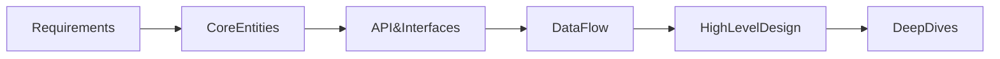

# High Level Design of URL shortner . 





## Requirements (Functional)
- Given a long URL , provide a shortURL ALIAS Example: https://www.google.com/maps/... -> short.com/ALPHA
      - User defined alias
- Given a short URL, you have to redirect into long URL)

## Requirements(Non-Functional)
- 100 M DAU (Ask)
- 100B URLs. Why is it important ? , it will help us estimate the number of characters in the short code.
- Uniqueness of the short code. 
- How many Millisecs to respond . Human eyes and senses can detect 100-200ms of lag, then it doesn't feel great experience, so 200ms for redirect. - Low latency
- CAP theorm
    - Consistency (Does after each right, read matters . Like once we create the short URL, is it required that every successive read provides 200 result)
        - The answer is no. Is it not required. If there are multiple servers, we can expect some time delay. However we expect eventual consistency
    - Availability - We require systems to be most available.
        - If we say that our system is 99.9 % up then our downtime is about 1 day.
        - If we have a 99.99% Up , our downtime reduces to 1 hr.
        - Based on that we have the availability .
    - Parition tolerance (THis is a guarentee. , you would have atleast 1 database and 1 service.)
        - Based on partition, we should favor availability.
- If I am using an API, so API security is a huge part of it. (It will prevent ingestion attacks)
        - SAST
        - OWASP(Open-api or swagger spec)
        - Dynamic Scan or conformance scan .
- We have to ratelimit the api , A single Box can handle 200 requests per sec. (50 requests per secs) 

## Back of the envelope estimation
- At this point this is useless. (Doing math for the sake of doing math is useless. ), so we will do math when we take a decision. 

## Core Entities
- This is the entities we store in the database and will pass into the system . I don't want to work on the full scale data model yet.
- Full URL
- Short URL
- Now the URL is so small of a problem that we can provide data model here.

## API EndPoint

### First Functional Requirement
```json
POST /urls
{
      originalUrl: String
      customAlias: String
      expirationTime: time
}
```
### 2nd functional Requirement 
```json
GET url

Return Status code: 202 or 203

```

## High Level Design 

- Do for API step by step by step .


``mermaid
 
flowchart LR;


```

