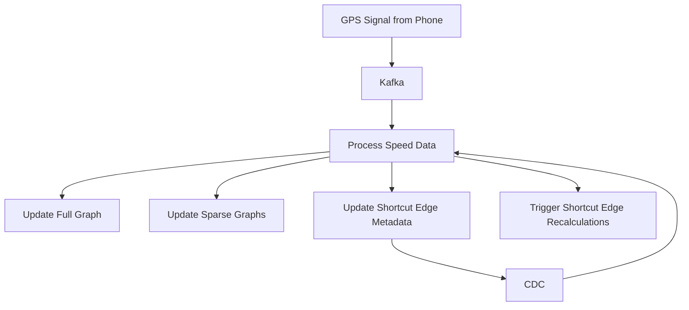

Here's a clean, structured **note + system design breakdown** based on the detailed Google Maps transcript you provided:

---

# 🧭 Google Maps System Design: How Distance and ETA Are Calculated and Updated

---

## 🧠 **Key Concepts**

### 🟢 Functional Requirements
1. Calculate the **fastest route** between any two locations.
2. Provide **accurate ETA (Estimated Time of Arrival)**.
3. **Dynamically update ETA** in real time as traffic and road conditions change.

---

### 📌 Graph Representation
- **Nodes**: Intersections, places, highway exits.
- **Edges**: Roads between nodes.
- **Metadata on edges**: Lat/lon, road name, travel time, speed limits, congestion data.

---

### 🌐 Scale and Capacity
- ~16M intersections (USA), ~200M places = ~50B nodes globally.
- Graph cannot fit on a single partition — requires **distributed storage & partitioning**.

---

## 🛣️ Route Calculation

### 1. **Dijkstra's Algorithm**
- Classic shortest-path algorithm used for routing.
- Works by:
  - Maintaining **settled**, **frontier**, and **unvisited** sets.
  - Repeatedly picking the nearest node to update distances.

### 2. **Why Dijkstra Isn’t Enough**
- Slow for large graphs.
- Inefficient over long distances (e.g., NY → California).

---

## ⚡ Optimization with **Contraction Hierarchies (CH)**

### What is CH?
- A preprocessing technique to reduce the graph size and improve search time.

### Techniques:
- 🔹 Remove unimportant edges (e.g., back roads).
- 🔹 Create **shortcut edges** to bypass minor nodes.
- 🔹 Multi-level sparse graphs (full graph → sparse → super sparse).

### Multi-level routing:
- Local routing: Use full graph.
- Medium distance: Use sparse graph (highways only).
- Long distance: Use super-sparse graph.

---

## 🗃️ Storage Layer

| Graph Type       | Storage             | Rationale |
|------------------|---------------------|-----------|
| Full base graph  | Neo4j (native graph DB) | Fast traversals via pointers |
| Sparse graphs    | In-memory (if small) or Neo4j | Cached for speed |
| Shortcut metadata | MySQL + CDC via Kafka | Rarely updated, good for storing dependencies |

---

## 🌍 Partitioning

- Use **GeoHash** to divide map into spatial regions.
- Hotspots (e.g., NYC) → more partitions or replicas.
- Ensures locality in routing and faster Dijkstra performance.

---

## 🚦 Real-Time Traffic & ETA Update System

### 1. **Collect GPS Data from Devices**
- Devices send **lat, lon, timestamp** continuously.
- Use velocity = distance / time.

### 2. **Map GPS to Road**
- Use **Hidden Markov Model (HMM)**:
  - Transition probabilities between roads.
  - Emission probabilities for GPS observations.
- Helps disambiguate GPS noise.

### 3. **Stream Processing Pipeline**
- Use **Kafka** to collect GPS events.
- Use **Apache Flink** to process:
  - Aggregate average speed per road (edge).
  - Maintain rolling windows (e.g., last 5 mins).
  - Efficiently update average using linked list & sum counters.

### 4. **Bubble-Up Mechanism**
- If a road’s speed drops significantly:
  - Update **shortcut edges** that depend on it.
  - Propagate changes to sparse/super-sparse graphs.
  - Recalculate route if ETA delta exceeds a threshold.

---

## 🧩 Shortcut Edge Dependency Management

- Maintain a **MySQL table**:
  - Maps real road IDs to shortcut edges that depend on them.
- Use **Change Data Capture (CDC)** to push updates into Flink.
- Dynamically update affected shortcut paths when base roads change.

---

## 🧪 ETA Recalculation Flow

---

## 🧵 System Summary

| Component                  | Tech Stack           |
|----------------------------|----------------------|
| Full Graph Storage         | Neo4j (Graph DB)     |
| Shortcut Dependency DB     | MySQL + CDC (via Debezium or similar) |
| Real-Time Streaming        | Kafka + Apache Flink |
| Route Calculation          | Dijkstra + Contraction Hierarchies |
| Partitioning Strategy      | GeoHash              |
| GPS Signal Mapping         | Hidden Markov Model (HMM) |
| Shortcut Graph Updates     | Bubbling up via Flink |
| Caching                    | In-Memory Sparse Graphs |

---

## 📈 Optimization Techniques

- Use **multi-layer contraction hierarchies** for different zoom levels.
- Cache **frequently accessed graph partitions** in memory.
- Apply **dynamic geohash sizing** for high-load areas.
- Trigger route recomputation only if delta in ETA crosses a **threshold**.
- Use **replication and sharding** for load balancing.

---

Would you like this as a downloadable PDF, or visual system architecture diagrams with components and data flow?
