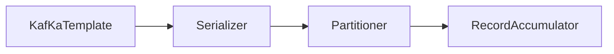

## Kafka topic Details .

When creating a kafka topic , you can create a number of partitions. You may not be able to reduce the number of partitions. 
Think of partition is a linklst and the end where data is stored is called as a offset. 
Across partition the order is ordered.  By default kafka topic stores data permanenely . 
When same key is provided , the event should be present in same partition , otherwise kafka kind of divides it in round robin fashion . 

### Kafka producer and Consumers


## Connect API

### Source connector 

Source connector pulls data from an external data source such as a database or a file. or elastic search into a Kafka topic. 


### Sink Connector

Source connector pulls data from kafka into database or a file. or elastic search 


### Streams API

Streams API is used to read from Kafka and do some transformation and put it back into Kafka . 


### Kafka Topic 
Kafka produces message into the Kafka topic . 
Kafka consumes message from the kafka topic.  
Kafka topic is a named entity like a table in DB . 
Producer in general produces 

### Parition 
Actual location where message resides . Topic may have 100 partition or more . 
Each partition is an ordered immutable sequence of record . 
Once record is produced it can't be changed. 
Offset play an important role - it 
Ordering is guarenteed in partition level . 

### Consumer offset

3 options for reading 
- from-beginning
- latest
- offset

__consumer_offset topic contains the consumer offset for each consumer. 

### Consumer group 

Drinking from the firshose problem - Not real time processing . 
Consumer poll is single threaded . So a single consumer from the consumer group can poll one partition of the group . 
Different applications have a unique groupId . 
Kafka broker manages consumer groups . 
The default partitioner separates the consumers and provides the message. 

### Commit Logs and retention policy 

/tmp/kafka-logs 

000000.log . 
Each partition has it's own log . 

### Retention policy 

Default 7 days . 
log.retention.hours = 168

Any data persisted to kafka topic is persisted in commit log . 

0000000.log . 

### Kafka Distributed Streaming system. 

Kafka brokers - each broker will have it's file system . 

### How kafka distributes Client Requests


### In sync replica 
min.insync.replicas = 3 
You won't be able to produce the msgs , unless 3 different brokers. 


### How is KafkaTemplate sending events 


- Any record sent to kafka is serialized first . There are 2 types of serializer . Key-serializer value serializer .
- Partitioner - Default partitioner (partition into specific partition)
- RecordAccumulaor - buffers the record and when the bufer is filled it is sent .
- batch.size - Record batch - represented as number of bytes.
- A set a batch.size for all partition is called buffer.ms
- linger.ms - The value is represented in ms . Once the specific millisec is reached, the batch is sent.

### Mandatory Values - to Configure kafka template
```
bootstrap-servers : localhost:9092, localhost:9093, localhost:9094 
key-serializer: org.apache.kafka.common.serialization.IntegerSerializer
value-serializer: org.apache.kafka.common.Serialization.StringSerializer 

```


